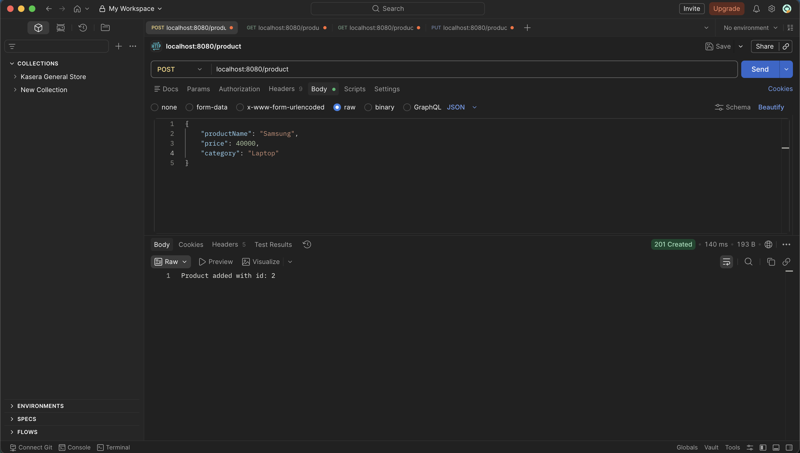
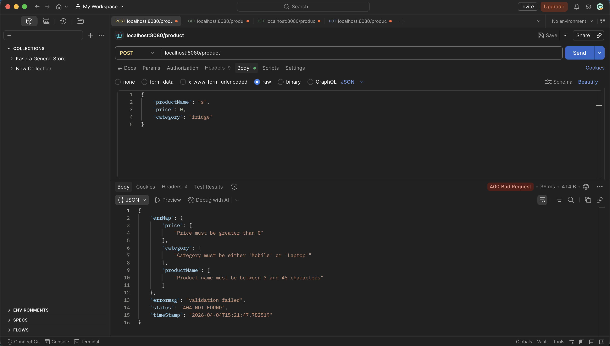
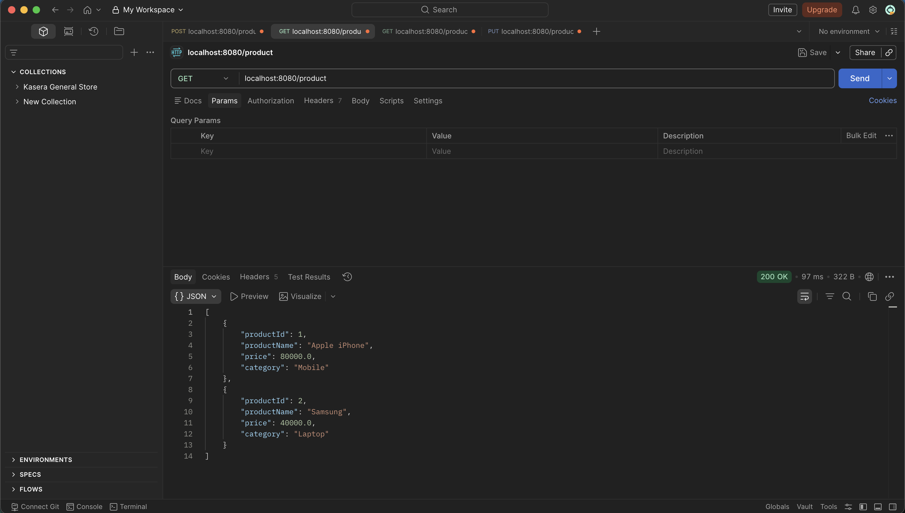
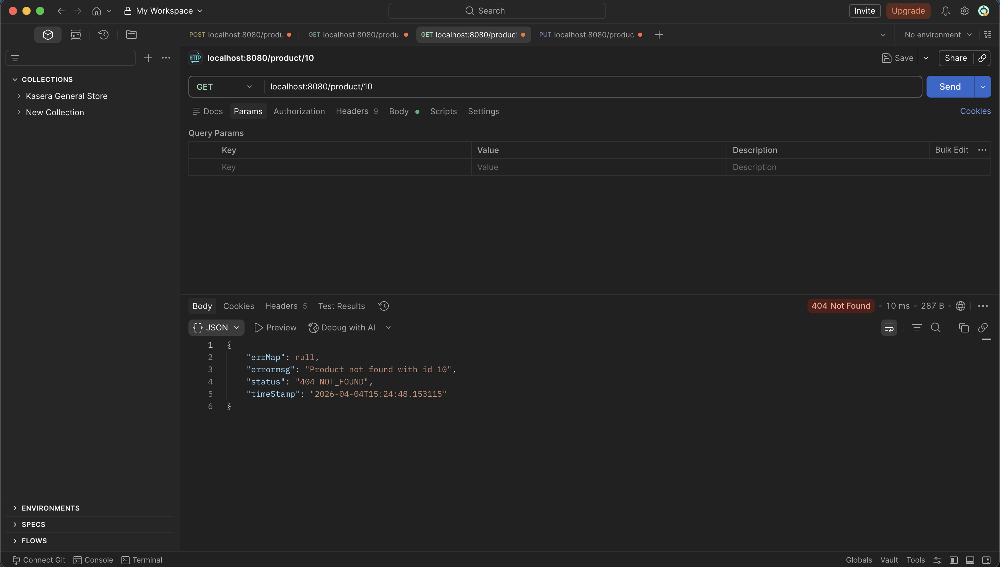
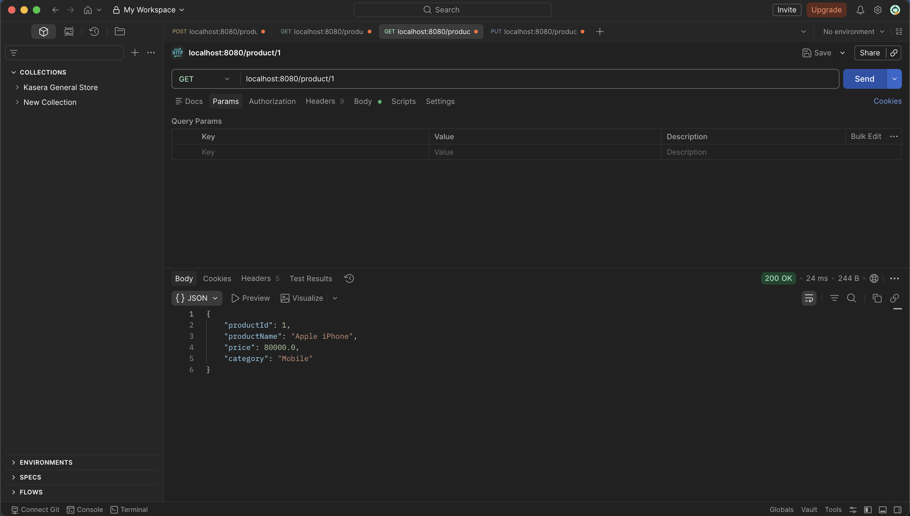
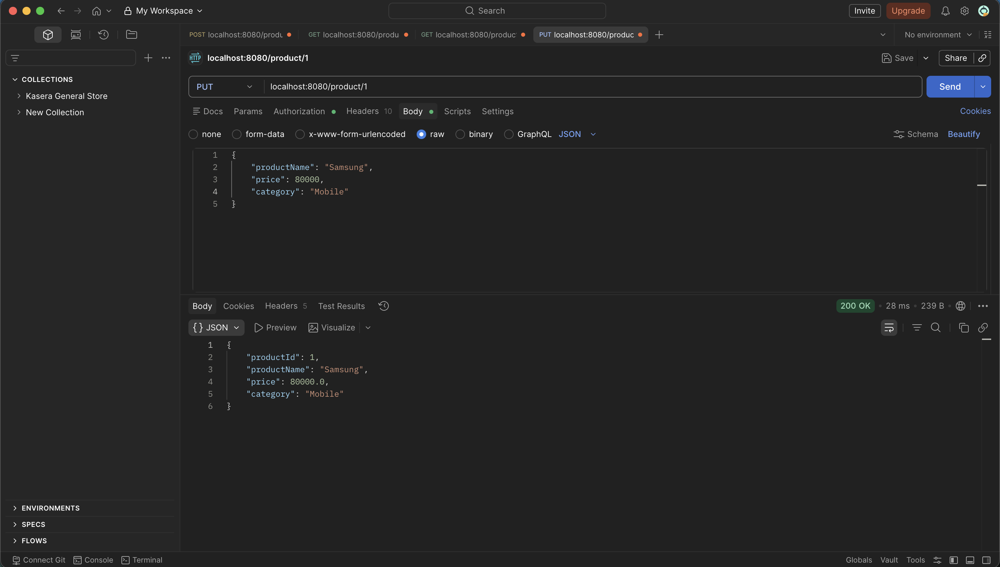

# Spring REST Product Management

Spring Boot REST API for managing products (add, list, fetch by ID, and update).

This project was created during Capgemini training on **4 April 2026**.

## Tech Stack

- Java 17
- Spring Boot 4
- Spring Data JPA
- H2 Database
- Maven

## API Endpoints

- `POST /product` - Create a product
- `GET /product` - Get all products
- `GET /product/{id}` - Get product by ID
- `PUT /product` - Update product

Sample payload:

```json
{
  "productName": "iPhone",
  "price": 79999,
  "category": "mobile"
}
```

## Run Locally

```bash
./mvnw spring-boot:run
```

App runs on `http://localhost:8080`.

## Postman Output







